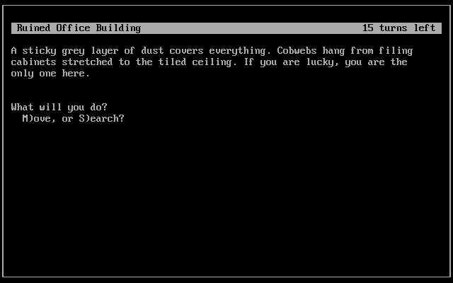

# Dark Sky

This is a port of the original Dark Sky by Ben "Bent" Ferguson:

* https://barelyconsciousgames.itch.io/dark-sky
* https://github.com/bferguson3/rpj3

This is his game, I made almost no changes to the game script, I just changed the interface from assembly and Borland C to curses.

## Background

The world has collapsed. The planet became dependent on a gigantic satellite network that has failed and crashed to Earth. It is for all intents and purposes the apocalypse.

You are one of a twin, but your sister is sick. Can you get her medicine before her time, and yours, runs out?

This is a standard text adventure which simplistic interactions and controls. No text parser. You have 15 turns to "solve" the map. Good luck!

## Usage

An executable `DARKSKY.EXE` is supplied for DOSBox play.

Compiles on Linux with ncurses or DJGPP with PDCurses.

## Copyright

Original game (c) 2021 Ben "Bent" Ferguson.

If you want to do anything with this game, ask him.

My engine-only changes are elevated to the public domain with Creative Commons Zero:

* https://creativecommons.org/publicdomain/zero/1.0/

